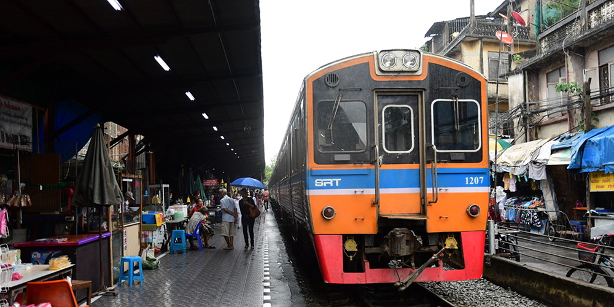
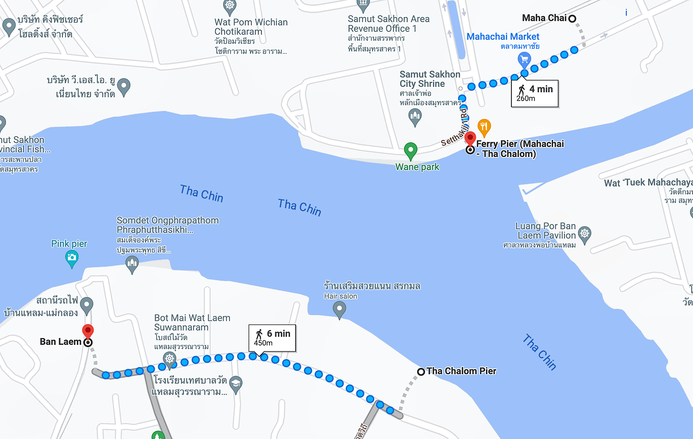
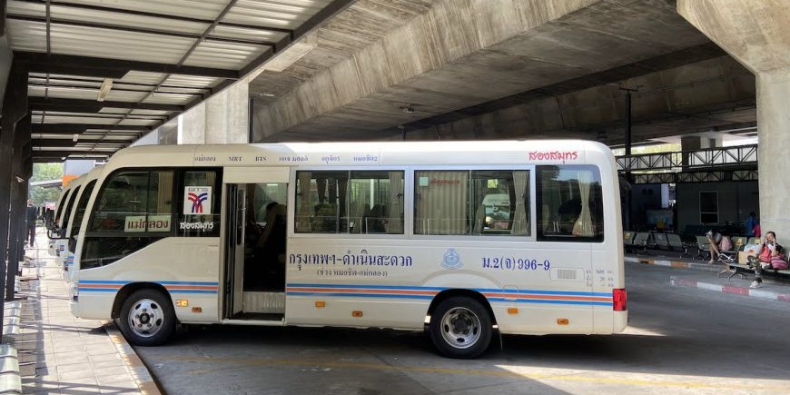
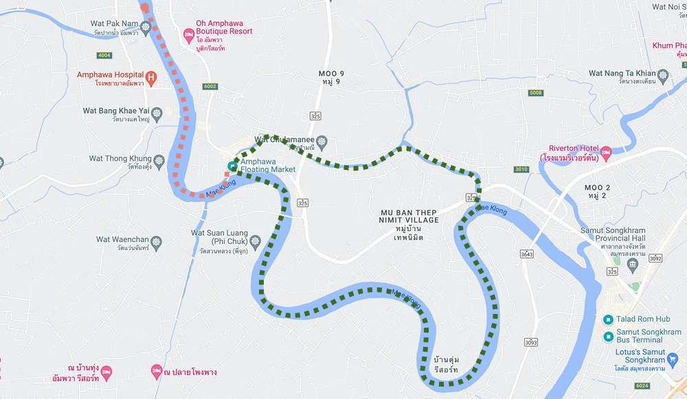
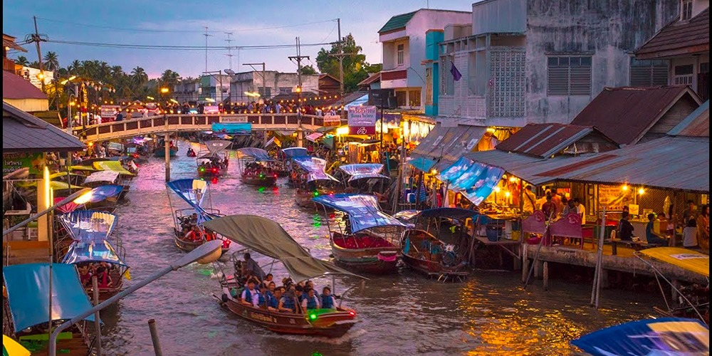

Mae Klong Railway Market, to wyjątkowy i tętniący życiem targ położony w prowincji Samut Songkhram w Tajlandii. Tym, co czyni ten rynek tak charakterystycznym, jest to, że znajduje się on wzdłuż aktywnych torów kolejowych. Kiedy nadjeżdża pociąg, sprzedawcy w pośpiechu chowają swoje stragany, aby zrobić miejsce dla przejeżdżającego pociągu, a następnie ustawiają je ponownie, gdy ten odjedzie. Wizyta na tym targu to niezwykłe doświadczenie, choć i te możemy poszerzyć jeszcze bardziej, odwiedzając pobliski wodny market i przejechać się tajskimi motorówkami.

# Kiedy zobaczymy przejeżdżający pociąg przez targ
Przejeżdżającego pociągu przez targ możemy spodziewać się w godzinach podanych w tabeli.

> Dane na dzień 01.11.2023, aby upewnić się co do zaistniałych zmian, aktualny rozkład jazdy znajdziemy na stronie [ttsview.railway.co.th](https://ttsview.railway.co.th/SRT_Schedule2022.php?ln=th&line=6&trip=2)

| Godziny przyjazdów | Godziny odjazdów |
|:------------------:|:----------------:|
|       06:20        |      07:19       |
|       09:00        |      10:00       | 
|       11:30        |      12:30       |
|       15:30        |      16:30       |

Jak widzimy po czasach, pociąg na Maeklong Railway Market pojawia się 4 razy dziennie, tak więc dobre planowanie czasu na wyjazd jest niezbędne, by zwiedzić targ oraz jego okolice.

# Jak dostać się na Targ
Do danego miejsca istnieją dwa transporty — kolej oraz bus. Z mojego doświadczenia, polecam wybrać się poranną trasą pociągiem, oraz korzystając z późniejszych odjazdów wrócić sobie spokojnie do Bangkoku busem.

## Podróż pociągiem
Pierwsze co musimy zrobić, by rozpocząć nasza podróż, jest dostanie się na dworzec [Wongwian Yai](https://maps.app.goo.gl/pNPW8oABNRr6rUEQ8). 

By się tam dostać, możemy skorzystać z:
- wysiąść na [BTS Wongwian Yai](https://maps.app.goo.gl/QCscKoDpWrXv5RoXA), ciemno-zielona linia BTS i przejść się _10min_ pieszo do dworca
- wysiąść na [MRT Tha Phra](https://maps.app.goo.gl/KArk58f9pAe1Xvjq9) i podjechać taksówką _6min_ do dworca
- zamówić taksówkę na Grab z dowolnego miejsca w mieście

Będąc na stacji, w okienku musimy kupić bilet do [Maha Chai](https://maps.app.goo.gl/SggutnM85PsNCp8u5). Podróż zaj nam około godziny. By załapać się na docelowy pociąg, mamy tak naprawdę do wyboru 2 godziny odjazdów. 

> Dane na dzień 01.11.2023, aby upewnić się co do zaistniałych zmian, aktualny rozkład jazdy znajdziemy na stronie [ttsview.railway.co.th](https://ttsview.railway.co.th/SRT_Schedule2022.php?ln=th&line=6&trip=2)

| Wongwian Yai | Maha Chai |
|:------------:|:---------:|
|    07:00     |   07:58   |
|    09:40     |   10:36   |

Gdy dotrzemy na miejsce, przy dworcu [Maha Chai](https://maps.app.goo.gl/SggutnM85PsNCp8u5) znajdziemy targ rybny. Jest to dobra okazja, by zwiedzić po drodze prawdziwe przymorskie miasteczko. 5 minut drogi od stacji, dojdziemy do [Promu (Mahachai — Tha Chalom)](https://maps.app.goo.gl/p2XQ4jtGutcC4psv9), który zabierze nas na drugą stronę rzeki. Stamtąd, ruszymy w dalszą drogę na stację [Ban Laem
](https://maps.app.goo.gl/6k3f8baz2WpQW6HB8) i pociąg przejeżdżający bezpośrednio przez [Mae Klong](https://maps.app.goo.gl/pwpUgjsEAkwfNu7x7) — Targ na Torach

## Podróż busem
Drugi, znacznie szybszy, lecz z pewnością z mniejszą ilością atrakcji jest podróż busem. Linia budów ta łączy bezpośrednio [Dworzec autobusowy Chatuchak aka Mochi 2
](https://maps.app.goo.gl/s99GhJtT1roWugxM8) z [Dworcem autobusowym Samut Songkhram](https://maps.app.goo.gl/RhRjMnqaXcFCKAre6). Minibusy podróżują w godzinach od 6:00 do 19:00. Choć warto sprawdzić aktualny grafik na [tej stronie](https://gogo.town/route/bangkok-samutsongkram-maeklong/), gdyż istnieje także możliwość powrotu do Bangkoku busem nawet o 20:30!

# Co warto zwiedzić oprócz Targu na torach (Maeklong Railway Market)
Piętnaście minut drogi taksówką/Grab do targu, znajduje się [Targ Wodny](https://maps.app.goo.gl/iENJrJNz7kYC4V7A7). O tyle jest on ciekawy i warty odwiedzenia, że przy jego kanale, znajdziemy oferty przejechania się łódką. Wycieczka powinna kosztować nas 100-200 THB od osoby.

U sprzedawców dostępne są dwie trasy
- Trasa widokowa po rzece i kanale, gdzie możemy zobaczyć budowle i codzienne życie zarówno w bogatej, jak i biednej części Samut Songkhram
- Trasa składająca się z odwiedzenia 5 świątyń oraz wizyta w zoo, gdzie za jedynie 100 THB dostaniemy wielki pęk zieleniny i możemy nakarmić zwierzaki

