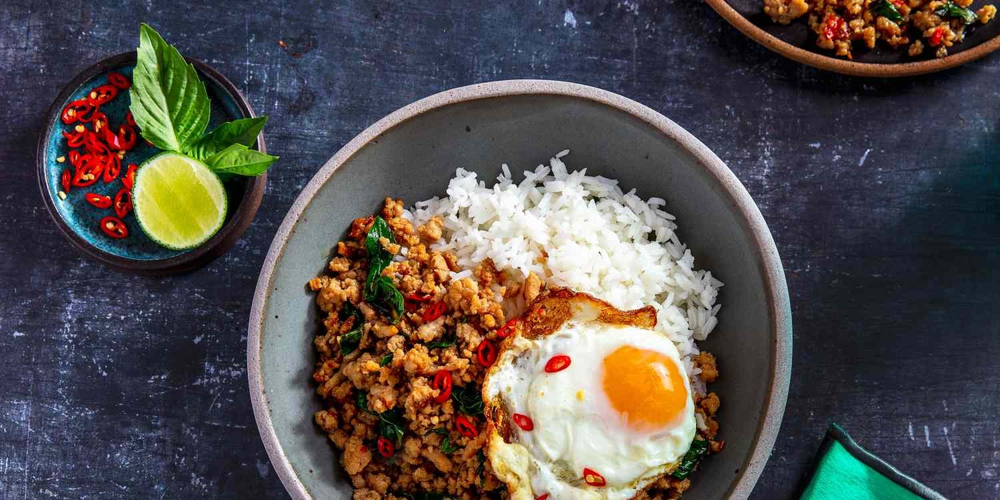
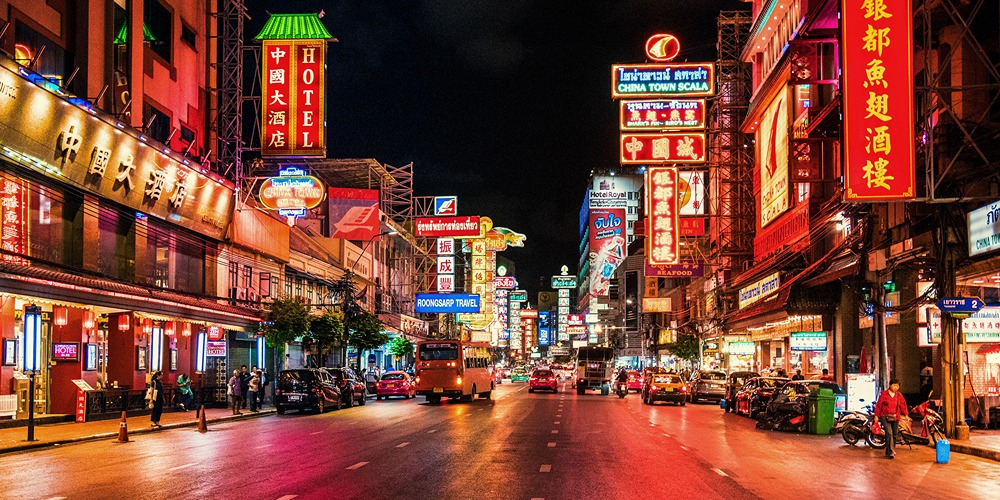
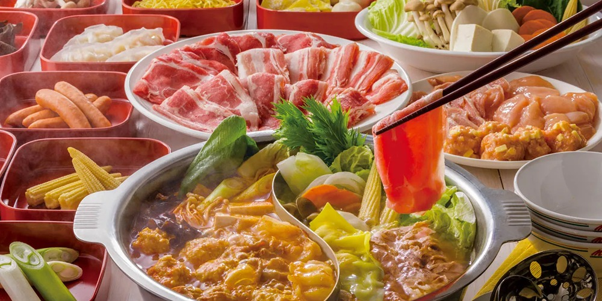
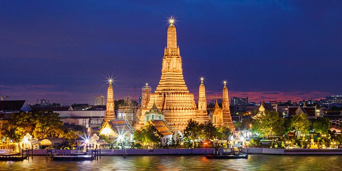
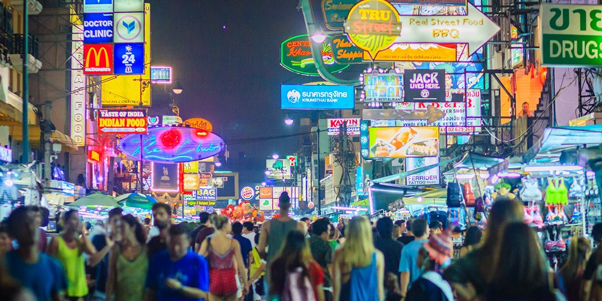
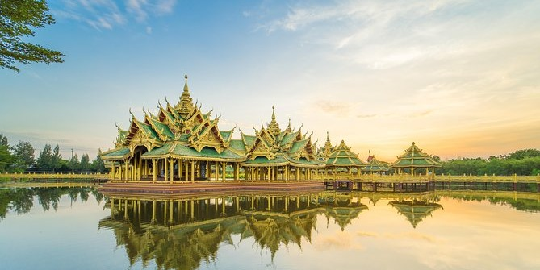
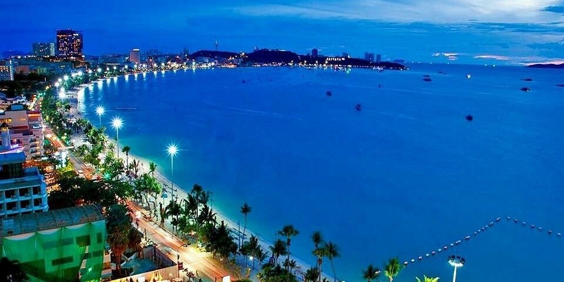

Bangkok jest stolicą Tajlandii i jej największym obszarem metropolitalnym. Przyciąga znaczną uwagę na całym świecie jako jedno z najbardziej turystycznych miast. Bangkok, obok _Chiang Mai_ i _Phuket_ stanowi jedno z trzech najważniejszych miast dla każdego podróżnika odkrywającego Tajlandię. Miasto oferuje szereg urzekających atrakcji turystycznych, obejmujących wyśmienitą kuchnię, modne dzielnice handlowe, świątynie, imprezowe ulice z muzyką grającą przez całą noc, współczesne drapacze chmur i wiele innych.

## 1. Zanurz się w tajskich przysmakach kulinarnych

Tajska kuchnia to jedna z największych atrakcji, jakich można doświadczyć podczas pobytu w Tajlandii. To właśnie tutaj można odkryć prawdziwy smak potraw, a także spróbować nowych dań, których niekoniecznie będzie można znaleźć w restauracji poza granicami tego kraju. Bangkok jest nasycony restauracjami oferującymi dania ze wszystkich zakątków Azji, ale warto także spróbować dań narodowych, takich jak **Pad Kra Pao** (Smażona wieprzowina z bazylią), **Chicken Khao Soi** (Tajska kokosowa zupa z makaronem curry), **Som Tam** (Tajska sałatka z zielonej papai), **Kuay Teow Reua** (Zupa z tajskim makaronem) czy **Joke** (Zupa ryżowa). Nie licząc licznych stoisk z streetfood'em i lokalnych marketów.

Warto również pamiętać, że chociaż Tajlandia słynie głównie z niedrogiego jedzenia, możemy również znaleźć coś, co zaspokoi nasze kubki smakowe w najlepszych restauracjach wyróżnionych gwiazdkami Michelin.

## 2. Zobacz dzielnicę Chinatown

[Chinatown](https://goo.gl/maps/PaYVMF8RcnqH8vZg6) jedno z największych chińskich miast na świecie. Zostało założone w 1782 roku, kiedy miasto zostało ustanowione stolicą. Po południu, spacerując jego uliczkami, możemy cieszyć się urokami tej dzielnicy. Choć z jedną dobrą radą - w godzinach wieczornych może być tu strasznie tłoczno. Warto więc zabrać ze sobą jak najmniej rzeczy, które mogą przeszkadzać innym turystom, a nam ograniczać swobodne poruszanie się w tłumie. W samym Chinatown możemy spodziewać się długich ulic z wystawionymi sprzedawcami, unikalnym dla tej dzielnicy jedzeniem i zewsząd rozświetloną szyldami ulicą. Na obrzeżach dzielnicy znajdziemy również 2 świątynie, które znajdują się w pobliżu [Chinatown Gate](https://goo.gl/maps/5Cv9bQDycWHC16mG7). 

Dla osób ciekawszych egzotycznych smaków, w dzielnicy znajdują się restauracje oferujące dość kontrowersyjną zupę z płetwy. Miłą informacją może być to, że bliżej weekendów istnieje szansa na natknięcie się na przechodzącą ulicami paradę.

## 3. Spróbuj Shabu i koreańskiego grilla

W świecie kulinarnych smaków nie może zabraknąć słowa o Shabu-Shabu, stylu jedzenia tak popularnego, że często tajowie potrafią umówić się na kolację dwa razy w tygodniu, jak nie częściej. Lecz czym to właściwie jest? Wyobraźmy sobie kociołek z bulionem postawiony na naszym stole. Wokół niego znajdą się składniki takie jak mięso, warzywa, makaron czy owoce morza. Mając składniki potrawy, po prostu wedłóg naszych upodobań, zanurzamy je do kociołka i gotujemy. Gotowe produkty zjadamy (często maczając je w sosie) i dzielimy się z przyjaciółmi. Co ciekawe, sama nazwa Shabu wzięło swoją nazwę od dźwięku zanurzania przy pomocy pałeczek składnika w bulionie (**shabu-shabu**). 

Oczywiście nie jest to jedyny rodzaj przygotowania tego dania. Do innych wariantów podania tego dania należy na przykład **Mookata** (posiada ono miejsce w środku na smażenie mięsa, a po bokach na zupę), **Korean Grill** (opcja smażenia mięsa na ruszcie przy użyciu węgla lub gazu), czy **Hot Pot** (garnek z bulionem, często występuje w wersji podzielonej na pół, dzięki czemu możemy mieć dwa buliony w jednym garnku, np. pikantny i grzybowy). W niektórych miejscach możemy nawet dostać kamienny grill, na którym możemy usmażyć rybę lub krewetki. 

Wiele z tych miejsc istnieje w formie bufetu **all-you-can-eat**, dając nam czas zazwyczaj w granicach 1,5h. Cena zazwyczaj waha się w granicach 200-350 THB (23-40zł).

Miejsca z tą koncepcją jedzenia:
- [โคริยะหมูกะทะ Korea Moo Ka Ta (Pork, Beef, Seafood BBQ Buffet)](https://goo.gl/maps/bjavgwLxpDidFJRF9)
- [Nene Korean BBQ Buffet](https://goo.gl/maps/6uec5f7AxJ5nrfYN6)
- [Khanoi Khor Shabu](https://goo.gl/maps/A4CgXPvPzuRvAy57A)
- [Shabushi by Oishi](https://goo.gl/maps/CCednWwDBozoxyzeA)

## 4. Świątynie

## 5. Przeskakuj między barami i ciesz się nocnym życiem Bangkoku

## 6. Odkryj repliki słynnych budowli

## 7. Pattaya, napij się drinka na plaży

## 8. Podziwiaj zachwycające widoki na miasto

## 9. Odwiedź oceanarium w centrum miasta

## 10. Sprawdź nocne markety

## 11. Wybierz pociąg do marketu przy torach (Train Market)

## 12. Wycieczka rowerowa po mieście

## + Jedź do Pattaya'i

Sprawdź więcej miejsc do odwiedzenia w innych popularnych miejscach w Tajlandii!

- Co warto odkryć w Pattaya
- Co warto odkryć w Chiang Mai