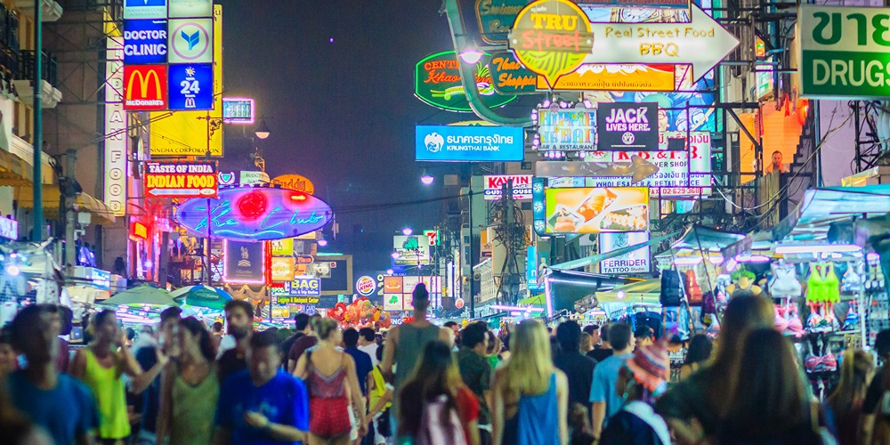
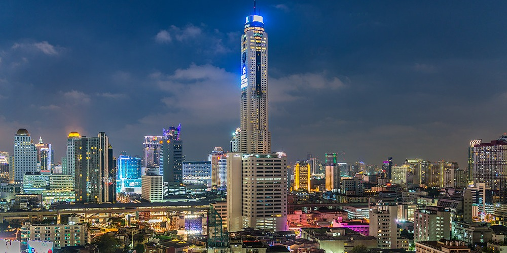
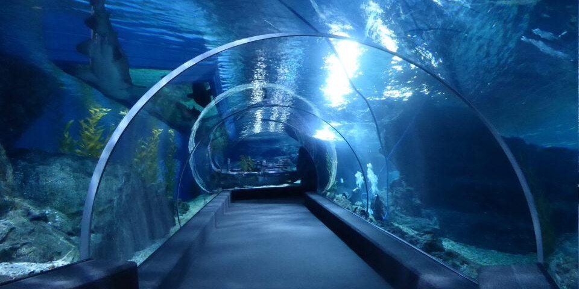
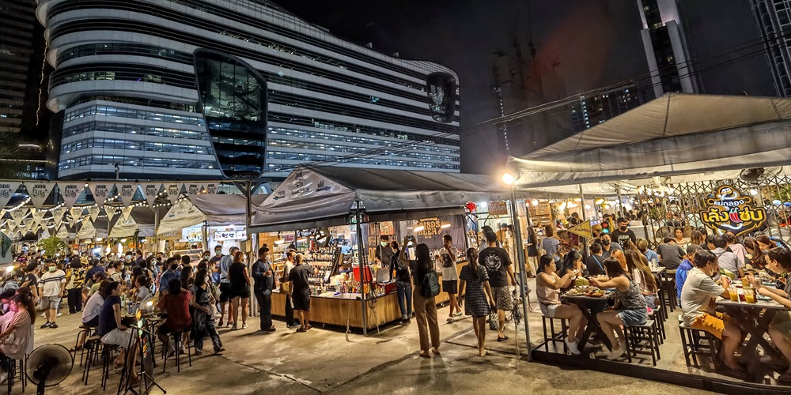
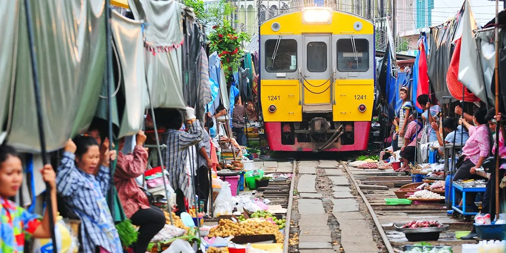
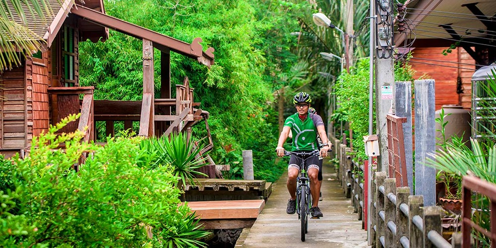

Bangkok jest stolicą Tajlandii i jej największym obszarem metropolitalnym. Przyciąga znaczną uwagę na całym świecie jako jedno z najbardziej turystycznych miast. Bangkok, obok _Chiang Mai_ i _Phuket_ stanowi jedno z trzech najważniejszych miast dla każdego podróżnika odkrywającego Tajlandię. Miasto oferuje szereg urzekających atrakcji turystycznych, obejmujących wyśmienitą kuchnię, modne dzielnice handlowe, świątynie, imprezowe ulice z muzyką grającą przez całą noc, współczesne drapacze chmur i wiele innych.

## 1. Zanurz się w tajskich przysmakach kulinarnych

Tajska kuchnia to jedna z największych atrakcji, jakich można doświadczyć podczas pobytu w Tajlandii. To właśnie tutaj można odkryć prawdziwy smak potraw, a także spróbować nowych dań, których niekoniecznie będzie można znaleźć w restauracji poza granicami tego kraju. Bangkok jest nasycony restauracjami oferującymi dania ze wszystkich zakątków Azji, ale warto także spróbować dań narodowych, takich jak **Pad Kra Pao** (Smażona wieprzowina z bazylią), **Chicken Khao Soi** (Tajska kokosowa zupa z makaronem curry), **Som Tam** (Tajska sałatka z zielonej papai), **Kuay Teow Reua** (Zupa z tajskim makaronem) czy **Joke** (Zupa ryżowa). Nie licząc licznych stoisk z streetfood'em i lokalnych marketów.

Warto również pamiętać, że chociaż Tajlandia słynie głównie z niedrogiego jedzenia, możemy również znaleźć coś, co zaspokoi nasze kubki smakowe w najlepszych restauracjach wyróżnionych gwiazdkami Michelin.

## 2. Zobacz dzielnicę Chinatown

[Chinatown](https://goo.gl/maps/PaYVMF8RcnqH8vZg6) jedno z największych chińskich miast na świecie. Zostało założone w 1782 roku, kiedy miasto zostało ustanowione stolicą. Po południu, spacerując jego uliczkami, możemy cieszyć się urokami tej dzielnicy. Choć z jedną dobrą radą — w godzinach wieczornych może być tu strasznie tłoczno. Warto więc zabrać ze sobą jak najmniej rzeczy, które mogą przeszkadzać innym turystom, a nam ograniczać swobodne poruszanie się w tłumie. W samym Chinatown możemy spodziewać się długich ulic z wystawionymi sprzedawcami, unikalnym dla tej dzielnicy jedzeniem i zewsząd rozświetloną szyldami ulicą. Na obrzeżach dzielnicy znajdziemy również 2 świątynie, które znajdują się w pobliżu [Chinatown Gate](https://goo.gl/maps/5Cv9bQDycWHC16mG7). 

Dla osób ciekawszych egzotycznych smaków, w dzielnicy znajdują się restauracje oferujące dość kontrowersyjną zupę z płetwy. Miłą informacją może być to, że bliżej weekendów istnieje szansa na natknięcie się na przechodzącą ulicami paradę.

## 3. Spróbuj Shabu i koreańskiego grilla

W świecie kulinarnych smaków nie może zabraknąć słowa o Shabu-Shabu, stylu jedzenia tak popularnego, że często Tajowie potrafią umówić się na kolację dwa razy w tygodniu, jak nie częściej. Czym to właściwie jest? Wyobraźmy sobie kociołek z bulionem postawiony na naszym stole. Wokół niego znajdą się składniki takie jak mięso, warzywa, makaron czy owoce morza. Mając składniki potrawy, po prostu według naszych upodobań, zanurzamy je do kociołka i gotujemy. Gotowe produkty zjadamy (często maczając je w sosie) i dzielimy się z przyjaciółmi. Co ciekawe, sama nazwa Shabu wzięło swoją nazwę od dźwięku zanurzania przy pomocy pałeczek składnika w bulionie (**shabu-shabu**). 

Oczywiście nie jest to jedyny rodzaj przygotowania tego dania. Do innych wariantów podania tego dania należy na przykład **Mookata** (ma ono miejsce w środku na smażenie mięsa, a po bokach na zupę), **Korean Grill** (opcja smażenia mięsa na ruszcie przy użyciu węgla lub gazu), czy **Hot Pot** (garnek z bulionem, często występuje w wersji podzielonej na pół, dzięki czemu możemy mieć dwa buliony w jednym garnku, np. pikantny i grzybowy). W niektórych miejscach możemy nawet dostać kamienny grill, na którym możemy usmażyć rybę lub krewetki. 

Wiele z tych miejsc istnieje w formie bufetu **all-you-can-eat**, dając nam czas zazwyczaj w granicach 1,5h. Cena zazwyczaj waha się w granicach 200-350 THB (23-40zł).

Miejsca z tą koncepcją jedzenia:
- [โคริยะหมูกะทะ Korea Moo Ka Ta (Pork, Beef, Seafood BBQ Buffet)](https://goo.gl/maps/bjavgwLxpDidFJRF9)
- [Nene Korean BBQ Buffet](https://goo.gl/maps/6uec5f7AxJ5nrfYN6)
- [Khanoi Khor Shabu](https://goo.gl/maps/A4CgXPvPzuRvAy57A)
- [Shabushi by Oishi](https://goo.gl/maps/CCednWwDBozoxyzeA)

## 4. Świątynie

Jako jeden z punktów planowania wycieczki do Bangkoku, warto wybrać się do świątyni. Najbardziej okazałą będzie w tym przypadku [Wat Arun](https://goo.gl/maps/DStdLvMeFzzsfzqQA), znajdującej się przy korycie rzeki. Warto mieć na uwadze, że do świątyni możemy dojść od przystanku [Itsaraphap](https://goo.gl/maps/kJ1XCQkgvowEuhww7) metra lub przepływając rzekę promem z przystanku [Tah Tian](https://goo.gl/maps/opHX9qz1DPcmcsu97) (Taka przyjemność powinna nas kosztować 10 THB). Pod świątynią istnieje także wiele wypożyczalni strojów, w których można wejść do świątyni i zrobić w nich zdjęcia. **Wynajem stroju** powinien być w granicach 300 THB, a samo wejście na teren Wat Arun kosztować nas będzie 100 THB.

Innymi świątyniami wartymi odwiedzenia będą [Wat Saket (The Golden Mount)](https://goo.gl/maps/yHWfxt7qc13ixtLD8) dającej także piękne widoki na miasto, świątynię [Wat Traimit Withayaram Worawihan](https://goo.gl/maps/SujYMxtS6wyTCfaT8) oraz kapliczkę [Kuan Yim Shrine ศาลเจ้าแม่กวนอิม (มูลนิธิเทียนฟ้า)](https://goo.gl/maps/vt9fsoUqbDahU1eB9) znajdujących się na dzielnicy Chinatown czy [Wat Phra Chetuphon Wimon](https://goo.gl/maps/KWpLq3DqfjAXSVwj6) — świątynię z leżącym 46-metrowym buddą.

## 5. Przeskakuj między barami i ciesz się nocnym życiem Bangkoku

Bangkok jest jednym z tych miast, gdzie życie nocne jest pełne kolorów. Otwarte bary pracują tu często do 2 rano, co pozwala każdemu, kogo jeszcze trzyma podróżniczy jetlag wyszaleć się w pierwszych dniach. Miasto posiada parę ulic imprezowych, gdzie każda ma swój własny klimat i "przeznaczenie". 

Do najpopularniejszej ulicy należy z pewnością [Sukhumvit 11](https://goo.gl/maps/hjXAKh94UwxJLVJK6) wraz z wszystkimi bocznymi uliczkami. Znajdziemy tu popularne bary jak [Havana Social](https://goo.gl/maps/5XoeFAbSr2mKKrb47), gdzie możemy zapalić kubańskie cygaro lub odwiedzić bardziej kameralne bary jak [Oskar Bistro Bangkok](https://goo.gl/maps/UR6BNCwQnUQTBHMk9) czy [Lush Rooftop](https://goo.gl/maps/rJG3quiJ3mquZ3kZ6).

Wielokrotnie polecaną ulicą imprezową w Bangkoku jest także [Khaosan Road](https://goo.gl/maps/NrbTruZ7DExbvH2h7). Znajdziemy tu wiele klubów z muzyką, tanim alkoholem, egzotycznym jedzeniem jak mięso krokodyla czy skorpiony. Ulica ta cieszy się dużą popularnością wśród backpakersów i osób lubiącym imprezować. Jest to z pewnością ulica, której turystycznie nie można przegapić. Chcąc na chwilę odpocząć od muzyki, możemy na chwilę wejść na drugą uliczkę [Soi Rambuttri](https://goo.gl/maps/Jn3yXUbBohVTofjU6), na której znajdziemy restauracje i mniejsze bary przydrożne.

Ulicą słynną z filmu _Kac Vegas w Bangkoku (Hangover II)_ jest [Soi Cowboy](https://goo.gl/maps/roMWSJ5dauh8GjEZ9). W tej neonowo oświetlonej uliczce znajdziemy z pewnością wiele klubów go-go, a poprzeczna ulica wypełniona jest "specjalnymi" masażami. Na krańcach Soi Cowboy będziemy mieli bary z kapelą i dobry jedzeniem. W okolicy także znajdziemy bardzo dobry pub [CRAFT (Sukhumvit 23)](https://goo.gl/maps/1wY9vSPNEnSNURTo8) sprowadzanymi z zachodu piwami. Jeśli nie wiesz gdzie się zatrzymać, a ciekawi Ciebie jak działa ta słynna ulica, możesz usiąść na chwilę i poobserwować — choć na pewno większą atrakcją będzie obserwowanie okolicy Nana.

Mówiąc już o Nana, a szczególnie o [Nana Plaza](https://goo.gl/maps/aLQzfoeEzNoiY8EL8), jest to dość specyficzne miejsce. Opisać je można pokrótce jako centrum klubów go-go. Oprócz ogólnego baru położonego w centralnej części budynku budynek posiada w sobie tylko kluby go-go. Do dyspozycji mamy 3 piętra, gdzie na każdym możemy znaleźć około 9 klubów. Każdy z nich specjalizuje się w innym typie prowadzenia tego biznesu, oferując gościom pokazy, przedstawienia, wyśmienitą muzykę czy duże prywatne loże — w zależności od zapotrzebowania klienta. Co ciekawe, jest to jedno z miejsc w Bangkoku, gdzie ceny alkohol są bardzo korzystne. Za piwo zapłacimy tutaj 90-120 THB (10-13zł), 200-250 THB (22-28zł) za alkohol wysokoprocentowy i lady-drinki. W poszukiwaniu najlepszych klubów kieruję do bloga [Bangkok Nightlife](https://bangkoknightlife.com/) dedykowanego takim atrakcjom.

## 6. Odkryj repliki słynnych budowli

[The Ancient City](https://goo.gl/maps/Yk36dUXidtKpRb2k7) jest unikalnym starożytnym miastem, mającym na celu pokazanie wiernej kopii zabytków znajdujących się na terenie całej Tajlandii. By dotrzeć do muzeum, należy wysiąść na ostatniej stacji Sukhumvit linii BTS [Kheha](https://goo.gl/maps/HjEcMipAvpvK6FsZ9) oraz przetransportować się lokalnym busem wskazując im miejsce, gdzie chcemy dojechać (Co około 5-10min znajdziemy przejeżdżające koło tracy furgonetki z ludźmi. Możemy złapać jedną na stopa i poprosić o zatrzymanie się pod muzeum — cały przejazd powinien wynieść nas 20 THB). Na miejscu będziemy mieć do wyboru trzy opcje transportu — pieszo, rowerem lub melexem. Z tych opcji osobiście polecam wybrać rower i swobodnie przemieszczać się po lokacji. 

Antyczne miasto jest pełne budowli świątyń, miasta na wodzie, krypt, replik tajskich domów i innych ciekawostek, przedstawiając historię Tajlandii, jej odpowiednich regionów (północna, północno-wschodnia, centralna, południowa oraz Suvarnabhumi). Na terenie znajdziemy także sklepy, restaurację i wypożyczalnię tradycyjnych ubrań.

## 7. Pattaya, napij się drinka na plaży

Zaledwie 2 godziny drogi od centrum Bangkoku znajduje się drugie miasto turystyczne — [Pattaya](https://goo.gl/maps/z6YDfAKDM73jLhXQ7). Miasto kusi turystów wszelkiego rodzaju atrakcjami, deptakiem [Walking Street](https://goo.gl/maps/1Xe7DLVS3h2r6pYA8), słynnymi spektaklami drag-show [Alcazar Cabaret Show
](https://goo.gl/maps/MxYdHxwbuZJmZWs78), a także piękną plażą oraz niedaleko znajdującą się wyspą [Ko Lan](https://goo.gl/maps/Rhk5o6YkC52WDXUK7). Nic dziwnego, że miasto jest to bardzo popularne wśród Tajów i turystów.

## 8. Podziwiaj zachwycające widoki na miasto

## 9. Odwiedź oceanarium w centrum miasta

## 10. Sprawdź nocne markety

## 11. Zabierz się pociągiem do marketu na torach (Train Market)

## 12. Wycieczka rowerowa po mieście

Sprawdź więcej miejsc do odwiedzenia w innych popularnych miejscach w Tajlandii!

- Co warto odkryć w Pattaya (w trakcie)
- Co warto odkryć w Phuket (w trakcie)
- Co warto odkryć w Chiang Mai (w trakcie)
