Planując podróż do Tajlandii, wiele osób zadaje pytanie "Co warto odwiedzić". Jako że sam temat jest szeroki jak rzeka, postanowiłem stworzyć stronę zbierającą informacje najciekawszych miejsc do zobaczenia w każdym z miast. Jako że w Bangkoku spędziłem najwięcej czasu, przedstawię go jako pierwszy.

## 1. Zanurz się w tajskiej kuchni
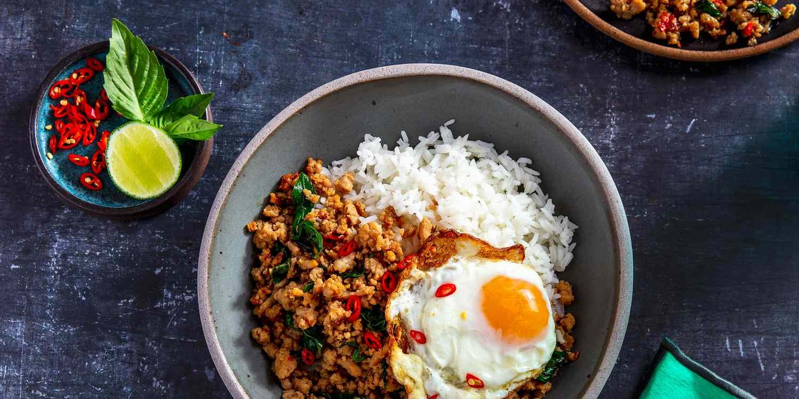

Tajlandia w swoim menu ma dużo więcej do zaoferowania niż tylko Pat Thai. W ofercie każdej restauracji znajdziemy o wiele więcej pozycji, których z pewnością nie znajdziemy w europejskich restauracjach, nie licząc nawet prawdziwego streetfood. Testując nowe dania i przysmaki, myślę, że z pewnością mogę polecić dane pozycje na liście

- Pad Kra Pao _[Pork Stir-fry Holy Basil]_ — myślę, że jest to najpopularniejsze danie Tajlandii. Przysmażona bazylia z wołowiną nadaje potrawie intensywny smak i ostrość.
- Khao soi — zupa curry z mlekiem kokosowym, popularna na północy Tajlandii. Ma naprawdę dobry smak curry, a chrupki makaron i warzywa dodatkowo nadają tej zupie wyjątkowości. W Polsce znajduje się tylko jedna restauracja oferującą tę zupę, więc z pewnością polecam spróbować oryginału, jak i samej kuchni północy. ([Baibua Cheng Tung and Northern Tai Cuisines](https://goo.gl/maps/bndfvCZX7CQ1qd4z6) jest jedną z niewielu restauracji w Bangkoku oferującą potrawy z tego regionu). 
- Som Tam _[Papaya Salad]_ — klasyczna sałatka z papaji, którą zajada się każdy taj. Istnieje w wielu rodzajach, lecz polecam spróbować klasycznej z dodatkiem kraba wzmacniającego smak owoców morza.
- Kuay Teow Reua _[Boat Noodles]_ — zupki z tajskim makaronem, podawane w małych porcjach. W niewielkim koszcie, mamy możliwość spróbowania tu kilku rodzajów makaronów i bulionów. Dobre, tanie i pożywne jedzenie.
- Jok _[Thai Congee]_— specjalna pozycja dla tych, którzy zaszaleją za bardzo na Khaosan Rd. Jest to lekki kleik ryżowy, dostępny w lodówkach w każdym 7/11 (pamiętajcie, że każde danie w Convenience Store może być podgrzane na miejscu!)

Na ulicach miasta można też znaleźć wiele streetfoodów oferujące mięso z grilla, kiełbaski, sałatki, lody czy gotowaną kukurydzę. Co więcej, na nocnych marketach można znaleźć dania, których nie znajdziemy typowo w restauracjach ani streetfoodach. Tak więc można powiedzieć, że każdego dnia można spróbować czegoś innego. 

Z mojego doświadczenia powiem, że kuchnia azjatycka w pełnej okazałości jest dostępna w Tajlandii z zachowaniem oryginalności i smaków potraw. Jako że kraje azjatyckie są na tyle blisko siebie, możemy spodziewać się tu także wielu japońskich Izakayi, knajpek z koreańskim kurczakiem i BBQ oraz wietnamskich restauracji. 

## 2. Zobacz chińską dzielnicę
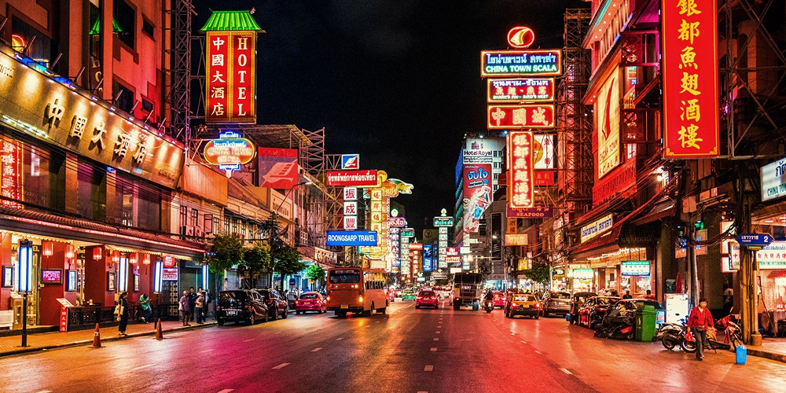

[Chinatown](https://goo.gl/maps/PaYVMF8RcnqH8vZg6) jest z pewnością piękną dzielnicą. Zwiedzając ją, możemy spodziewać się długich ulic z wystawionymi sprzedawcami, unikalnym dla niej jedzeniem i zewsząd rozświetloną szyldami ulicą. Najlepszą porą na zwiedzanie tej części miasta z pewnością będzie wieczór, choć z jedną dobrą radą — w godzinach wieczornych może być tu strasznie tłoczno. Warto więc nie zabierać z sobą dużo rzeczy, by nie ograniczać się w swobodnym poruszaniu się w tłumie. Zwiedzanie dzielnicy polecam zacząć od [Chinatown Gate](https://goo.gl/maps/5Cv9bQDycWHC16mG7), gdzie na jej początku znajdziemy już unikalną chińską świątynię. 

## 3. Spróbuj Shabu i Korean BBQ
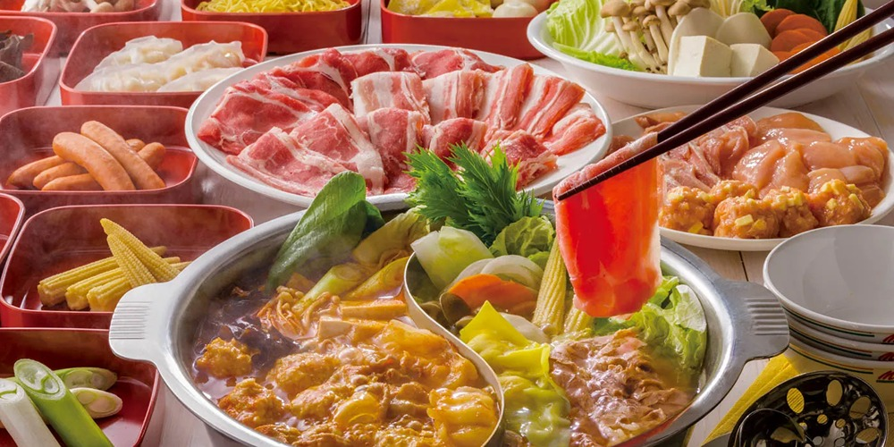

W świecie kulinarnych smaków nie może zabraknąć słowa o Shabu-Shabu, stylu jedzenia tak popularnego, że często Tajowie potrafią umówić się na kolację dwa razy w tygodniu, jak nie częściej. Czym to właściwie jest? Wyobraźmy sobie kociołek z bulionem postawiony na naszym stole. Wokół niego znajdą się składniki takie jak mięso, warzywa, makaron czy owoce morza. Mając składniki potrawy, po prostu według naszych upodobań, zanurzamy je do kociołka i gotujemy. Gotowe produkty zjadamy (często maczając je w sosie) i dzielimy się z przyjaciółmi. Co ciekawe, sama nazwa Shabu wzięło swoją nazwę od dźwięku zanurzania przy pomocy pałeczek składnika w bulionie (_shabu-shabu_). 

Oczywiście nie jest to jedyny rodzaj przygotowania tego dania. Warianty podania możemy znaleźć pod różną nazwą jak _Mookata_, _Korean Grill_, _Shabu_, czy _Hot Pot_ w zależności od kraju pochodzenia i naczynia, w którym jest przyrządzane. W niektórych miejscach możemy nawet dostać kamienny grill, na którym usmażymy rybę lub krewetki. 

Wiele z tych miejsc istnieje w formie bufetu **all-you-can-eat**, dając nam czas zazwyczaj w granicach 1,5h. Cena zazwyczaj waha się w granicach 200-350 THB (23-40zł).

Miejsca z tą koncepcją jedzenia:
- [โคริยะหมูกะทะ Korea Moo Ka Ta (Pork, Beef, Seafood BBQ Buffet)](https://goo.gl/maps/bjavgwLxpDidFJRF9)
- [Nene Korean BBQ Buffet](https://goo.gl/maps/6uec5f7AxJ5nrfYN6)
- [Khanoi Khor Shabu](https://goo.gl/maps/A4CgXPvPzuRvAy57A)
- [Shabushi by Oishi](https://goo.gl/maps/CCednWwDBozoxyzeA)
- [จ่าอูหมูเกาหลี สาขารัชโยธิน](https://goo.gl/maps/PDmzRD6dikzvkNrg9)

## 4. Świątynie
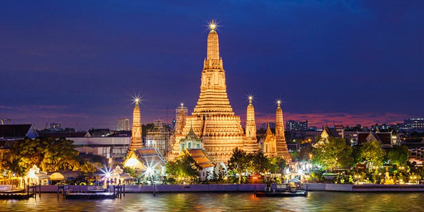

Jako jeden z punktów planowania wycieczki do Bangkoku, warto wybrać się do świątyni. Najbardziej okazałą będzie w tym przypadku [Wat Arun](https://goo.gl/maps/DStdLvMeFzzsfzqQA), znajdującą się przy korycie rzeki. Warto mieć na uwadze, że do świątyni możemy dojść od przystanku [Itsaraphap](https://goo.gl/maps/kJ1XCQkgvowEuhww7) metra lub przepływając rzekę promem z przystanku [Tah Tian](https://goo.gl/maps/opHX9qz1DPcmcsu97) (Taka przyjemność powinna nas kosztować 10 THB). Pod świątynią istnieje także wiele wypożyczalni strojów, w których można wejść do świątyni i zrobić sobie w nich zdjęcia. Wynajem stroju powinien być w granicach 300 THB, a samo wejście na teren Wat Arun kosztować nas będzie 100 THB.

Innymi świątyniami wartymi odwiedzenia będą [Wat Saket (The Golden Mount)](https://goo.gl/maps/yHWfxt7qc13ixtLD8) dającej także piękne widoki na miasto, świątynię [Wat Traimit Withayaram Worawihan](https://goo.gl/maps/SujYMxtS6wyTCfaT8) oraz kapliczkę [Kuan Yim Shrine ศาลเจ้าแม่กวนอิม (มูลนิธิเทียนฟ้า)](https://goo.gl/maps/vt9fsoUqbDahU1eB9) znajdujących się na dzielnicy Chinatown czy [Wat Phra Chetuphon Wimon](https://goo.gl/maps/KWpLq3DqfjAXSVwj6) — świątynię z leżącym 46-metrowym buddą.

## 5. Przeskakuj między barami i ciesz się nocnym życiem Bangkoku

Bangkok jest jednym z tych miast, gdzie życie nocne jest pełne kolorów. Otwarte bary pracują tu często do 2 rano, co pozwala każdemu, kogo jeszcze trzyma podróżniczy jetlag wyszaleć się w pierwszych dniach. Miasto posiada parę imprezowych ulic, gdzie każda ma swój własny klimat i "przeznaczenie". 

Do najpopularniejszej ulicy należy z pewnością [Sukhumvit 11](https://goo.gl/maps/hjXAKh94UwxJLVJK6) wraz z wszystkimi bocznymi uliczkami. Znajdziemy tu popularne bary jak [Havana Social](https://goo.gl/maps/5XoeFAbSr2mKKrb47), gdzie możemy zapalić kubańskie cygaro lub odwiedzić bardziej kameralne bary jak [Oskar Bistro Bangkok](https://goo.gl/maps/UR6BNCwQnUQTBHMk9) czy [Lush Rooftop](https://goo.gl/maps/rJG3quiJ3mquZ3kZ6).

Wielokrotnie polecaną ulicą imprezową w Bangkoku jest także [Khaosan Road](https://goo.gl/maps/NrbTruZ7DExbvH2h7). Znajdziemy tu wiele klubów z muzyką, tanim alkoholem i egzotycznym jedzeniem jak mięso krokodyla czy skorpiony. Ulica ta cieszy się dużą popularnością wśród backpakersów i osób lubiącym imprezować. Jest to z pewnością ulica, której turystycznie nie można przegapić. Chcąc na chwilę odpocząć od muzyki, możemy na chwilę wejść na drugą uliczkę [Soi Rambuttri](https://goo.gl/maps/Jn3yXUbBohVTofjU6), na której znajdziemy restauracje i mniejsze przydrożne bary.

Ulicą słynną z filmu _Kac Vegas w Bangkoku [Hangover II]_ jest [Soi Cowboy](https://goo.gl/maps/roMWSJ5dauh8GjEZ9). W tej neonowo oświetlonej uliczce znajdziemy z pewnością wiele klubów go-go, a poprzeczna ulica wypełniona jest "specjalnymi" masażami. Na krańcach Soi Cowboy będziemy mieli bary z kapelą i dobry jedzeniem. Jeśli nie wiesz gdzie się zatrzymać, a ciekawi Ciebie jak działa ta słynna ulica, możesz usiąść na chwilę i poobserwować — choć na pewno większą atrakcją będzie obserwowanie okolicy Nana. W okolicy także znajdziemy bardzo dobry pub [CRAFT (Sukhumvit 23)](https://goo.gl/maps/1wY9vSPNEnSNURTo8) ze sprowadzanymi z zachodu piwami. 

Mówiąc już o Nana, a szczególnie o [Nana Plaza](https://goo.gl/maps/aLQzfoeEzNoiY8EL8), jest to dość specyficzne miejsce. Opisać je można pokrótce jako centrum klubów go-go. Oprócz ogólnego baru położonego w centralnej części budynku budynek posiada w sobie tylko kluby go-go. Do dyspozycji mamy 3 piętra, gdzie na każdym możemy znaleźć około 9 klubów. Każdy z nich specjalizuje się w innym typie prowadzenia tego biznesu, oferując gościom pokazy, przedstawienia, wyśmienitą muzykę czy duże prywatne loże — w zależności od zapotrzebowania klienta. Co ciekawe, jest to jedno z miejsc w Bangkoku, gdzie ceny alkohol są bardzo korzystne. Za piwo zapłacimy tutaj 90-120 THB (10-13zł), 200-250 THB (22-28zł) za alkohol wysokoprocentowy i lady-drinki. W poszukiwaniu najlepszych klubów kieruję do bloga [Bangkok Nightlife](https://bangkoknightlife.com/) dedykowanego takim atrakcjom.

## 6. Odkryj repliki słynnych budowli
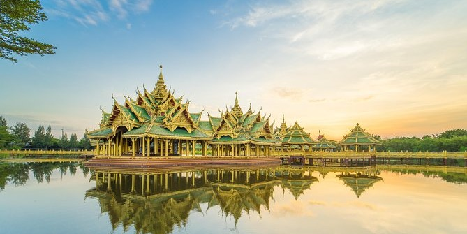

[The Ancient City](https://goo.gl/maps/Yk36dUXidtKpRb2k7) jest unikalnym starożytnym miastem, mającym na celu pokazanie wiernej kopii zabytków znajdujących się na terenie całej Tajlandii. By dotrzeć do muzeum, należy wysiąść na ostatniej stacji Sukhumvit linii BTS [Kheha](https://goo.gl/maps/HjEcMipAvpvK6FsZ9) oraz przetransportować się lokalnym busem wskazując im miejsce, gdzie chcemy dojechać (Co około 5-10min znajdziemy przejeżdżające koło trasy furgonetki z ludźmi. Możemy złapać jedną na stopa i poprosić o zatrzymanie się pod muzeum — cały przejazd powinien wynieść nas 20 THB). Na miejscu będziemy mieć do wyboru trzy opcje transportu — pieszo, rowerem lub melexem. Z tych opcji osobiście polecam wybrać rower i swobodnie przemieszczać się po lokacji. 

Antyczne miasto jest pełne budowli świątyń, miasta na wodzie, krypt, replik tajskich domów i innych ciekawostek, przedstawiając historię Tajlandii, jej różnych regionów. Na terenie znajdziemy także sklepy, restaurację i wypożyczalnię tradycyjnych ubrań.

## 7. Pattaya, napij się drinka na plaży
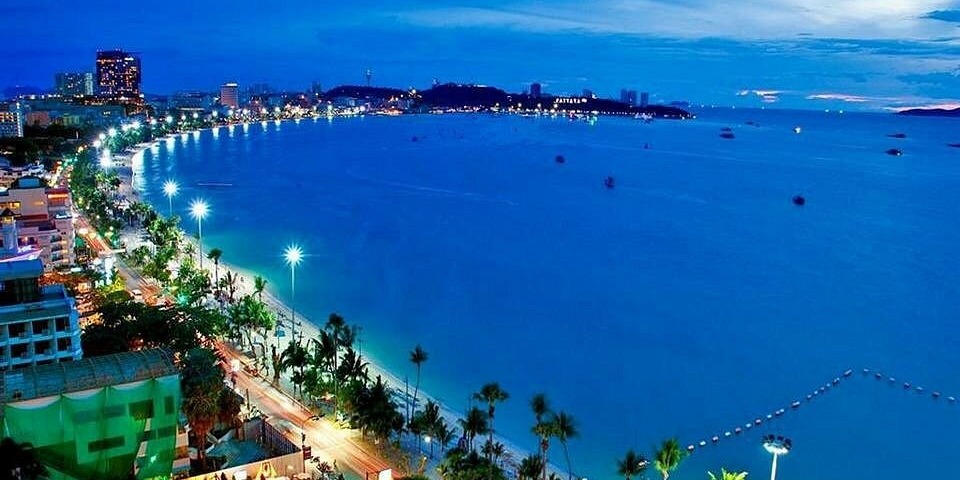

Zaledwie 2 godziny drogi od centrum Bangkoku znajduje się drugie miasto turystyczne — [Pattaya](https://goo.gl/maps/z6YDfAKDM73jLhXQ7). Miasto kusi turystów wszelkiego rodzaju atrakcjami, deptakiem [Walking Street](https://goo.gl/maps/1Xe7DLVS3h2r6pYA8), słynnymi spektaklami drag-show [Alcazar Cabaret Show
](https://goo.gl/maps/MxYdHxwbuZJmZWs78), a także piękną plażą oraz niedaleko znajdującą się wyspą [Ko Lan](https://goo.gl/maps/Rhk5o6YkC52WDXUK7). Nic dziwnego, że miasto jest to bardzo popularne wśród Tajów i turystów.

## 8. Podziwiaj zachwycające widoki na miasto
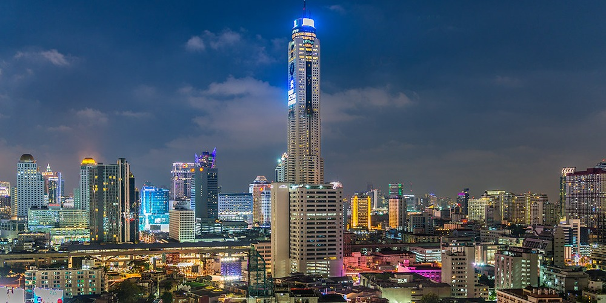

Chcąc zobaczyć piękne widoki miasta, za dnia i w nocy, warto wybrać się do punktów widokowych. Poniżej znajduje się najpopularniejszych punktów 

- [Wat Saket (The Golden Mount)](https://goo.gl/maps/KnrV8ApBm641oMpH8)
- [Baiyoke Tower 2](https://goo.gl/maps/yXhzYnz4KJrtCrpK7)
- [MahaNakhon](https://goo.gl/maps/bHpu7pzRYjKz9omLA)

## 9. Odwiedź oceanarium w centrum miasta
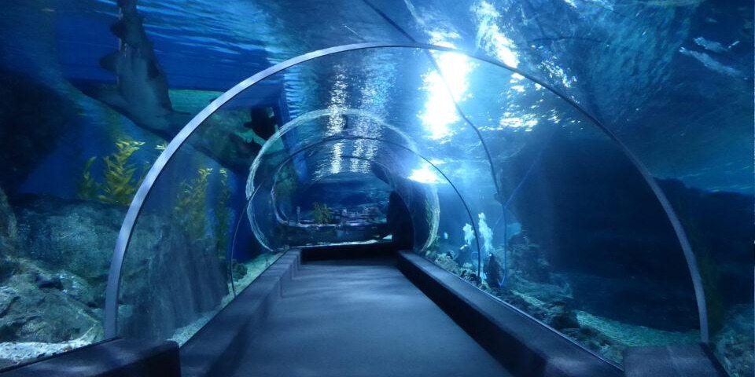

Jedną z ciekawszych rzeczy w Bangkoku jest oceanarium [SEA LIFE Bangkok Ocean World](https://goo.gl/maps/oRobvcibgtjcFfAB8) zlokalizowane pod galerią handlową. Na miejscu zobaczymy kilka stref zwiedzania, gdzie możemy skorzystać z łódki z "przeźroczystym" dnem, zobaczyć ogród botaniczny z płazami, podwodny korytarz, kopułę z padającym śniegiem czy zakrzywioną immersyjną szybę. Porównując skalę oceanariów, to w Bangkoku może być lekko większe niż znajdujące się we Wrocławiu Afrykarium. Bilet wstępu kosztować będzie nas 800 THB (95zł), lecz dopłacając 20zł, dodatkowo możemy dostać bilet wstępu do muzeum figur woskowych [Madame Tussauds BANGKOK](https://goo.gl/maps/QZ2YSGZBWxDmrmeJ9), znajdującego się w galerii obok. Czas zwiedzania tych dwóch miejsc może nam zająć nawet i 3 godziny.

## 10. Sprawdź nocne markety
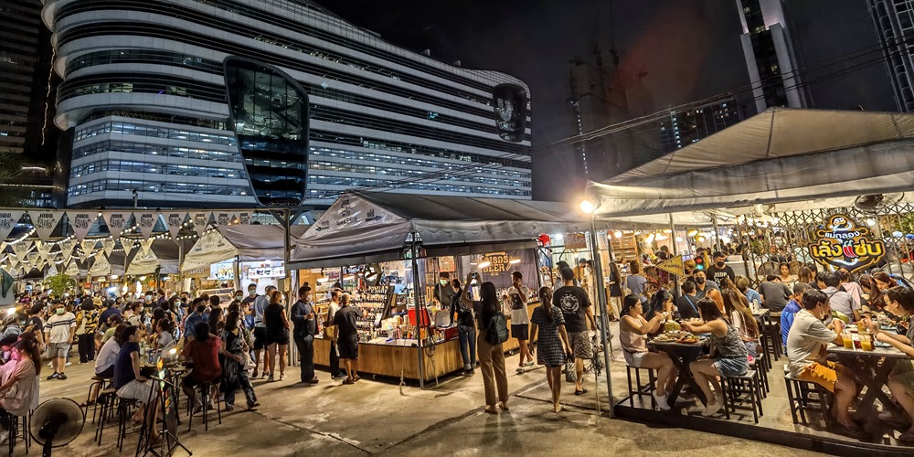

Dużą zaletą Tajlandii są z pewnością markety. Znajdziemy na nich wiele różnych usługodawców jak fryzjerów, kosmetyczki, sklepiki z ubraniami czy przyprawami. Co jednak je wypełnia, to stanowiska z jedzeniem. Znajdziemy tu przeróżne stanowiska z daniami, jak Leng Saap _[XXL Pork Spine “Mountain”]_ — bardzo ostrą górę mięsa, suszone robaki, opalane małże, sałatki ze skaczącymi żywymi krewetkami, czy tajskie pancake'i _[Thai Roti]_ które znajdziemy tylko w tych miejscach.

- [JODD FAIRS DanNeramit](https://goo.gl/maps/b9xZNg8WDunXesbE7) — nowo otwarty market z Instagram'able zamkiem oraz wieczornymi pokazami
- [Chatuchak Weekend Market](https://goo.gl/maps/8UXivBovQsRkJMbK6) — potężny market połączony z galerią handlową. Znajdziemy tu wszystko od czegoś do zjedzenia aż po pamiątki turystyczne.
- [The One Ratchada](https://goo.gl/maps/LMn9pfwGg57peqtw9)
- [Ruam Sab Market](https://goo.gl/maps/kAWoJNxSorVwyYM89) — market obiadowy, działający od 10:00 do 13:00. Znajdziemy tu wiele knajpek oferujących przeróżne azjatyckie dania
- [SWU International Flea Market](https://goo.gl/maps/B429cKBzGBL1GEGN8) — market obiadowy, działający od 09:00 do 13:00 otwarty we **wtorki** i **czwartki** zlokalizowany na kampusie uczelni.

## 11. Pociągiem przez środek marketu
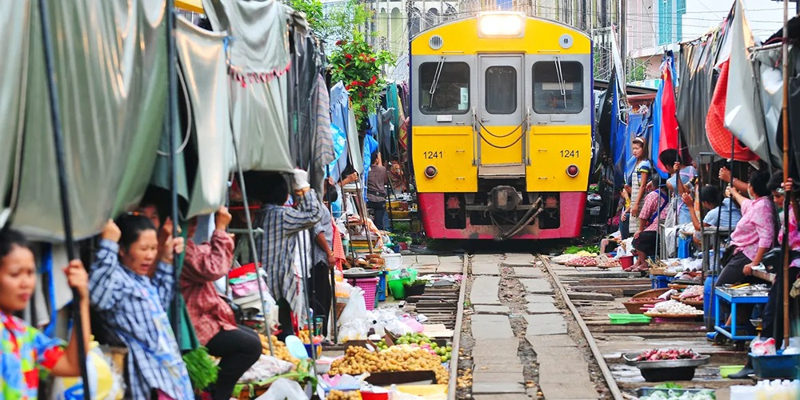

Jednym z unikalnych marketów jest z pewnością [Talad Rom Hub Market — Samut Songkhram](https://goo.gl/maps/ZzfpFY76CHEH34Db8), przez którego środek, kilka razy dziennie przejeżdża pociąg. Jest on oddalony 1.5h na zachód od Bangkoku. Możemy do niego dojechać bezpośrednio busem lub ruszyć pociągiem ze stacji [Wongwian Yai](https://goo.gl/maps/MbnvXyhATxPYQs668), przesiadając się potem na stacji [Ban Laem](https://goo.gl/maps/u8xmXnmdtUar9n7W8). Chcąc spędzić więcej czasu w okolicach Bangkoku, możemy zajrzeć także na [Amphawa Floating Market](https://goo.gl/maps/TpLGe9HFu5FVKAgn9), gdzie oprócz przyrzecznego marketu, możemy wynająć także wycieczkę łódką wzdłuż rzeki, zwiedzając 4-6 przyrzecznych świątyń, a także mini zoo.

## 12. Wycieczka rowerowa po mieście
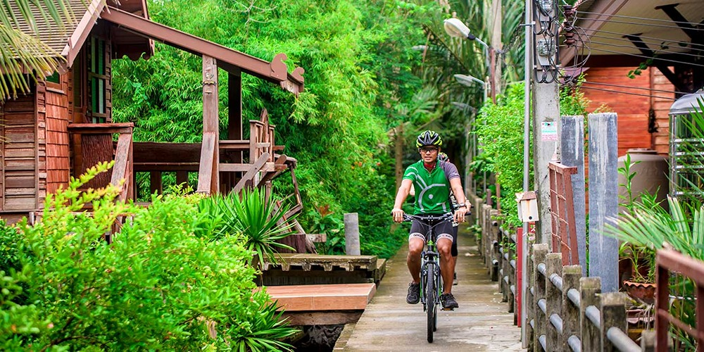

Dla chwili relaksu warto ruszyć przez miasto na wycieczkę rowerową. Na odpoczynek można wybrać się do parku
[Chatuchak Park](https://goo.gl/maps/bbt9rtEdypeMSVMv5) oraz [wynająć rower](https://goo.gl/maps/dx5GQ9CC2EkLUG6HA). Okolica posiada bardzo ładne ścieżki rowerowe, pola kwiatów gdzie można zrobić sobie zdjęcia, a po drodze trafimy nawet na motylarnię.

Dla tych kto, kto jednak chce szybciej zwiedzić najważniejsze punkty turystyczne Bangkoku, polecam wybrać się na organizowaną wycieczkę rowerową przez [covankessel.com](https://www.covankessel.com/). Firma może pochwalić się wieloma pozytywnymi recenzjami — także wśród moich znajomych, którzy z nich korzystali. Drugą opcją, jest zamówienie indywidualnej wycieczki u [Bangkok Pat](https://www.facebook.com/profile.php?id=100076442733368), dopasowanej do naszych potrzeb, którą także wiele osób zachwala.
___

Sprawdź więcej miejsc do odwiedzenia w popularnych w Tajlandii!

- Co warto odkryć w Pattaya (w trakcie)
- Co warto odkryć w Phuket (w trakcie)
- [Co warto odkryć w Chiang Mai](/co-warto-odkryc-w-chiang-mai)
