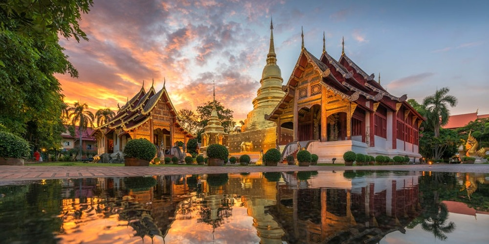
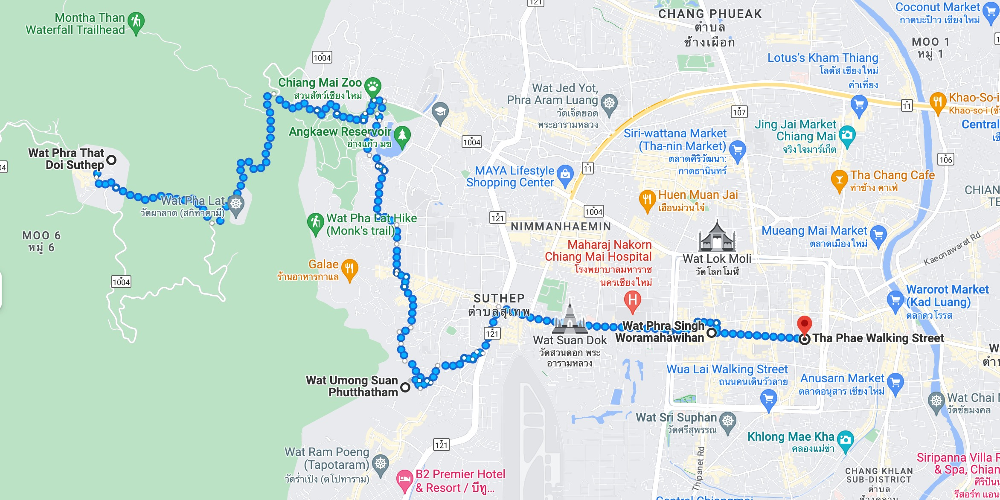
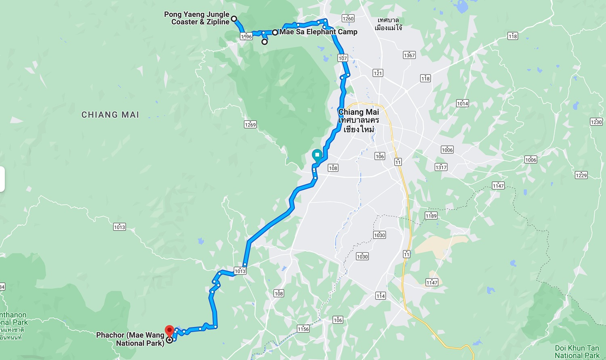
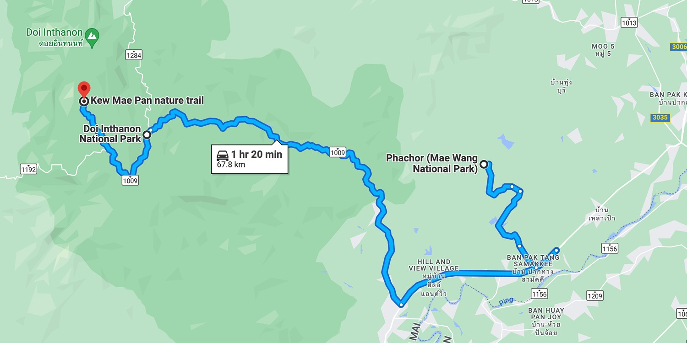
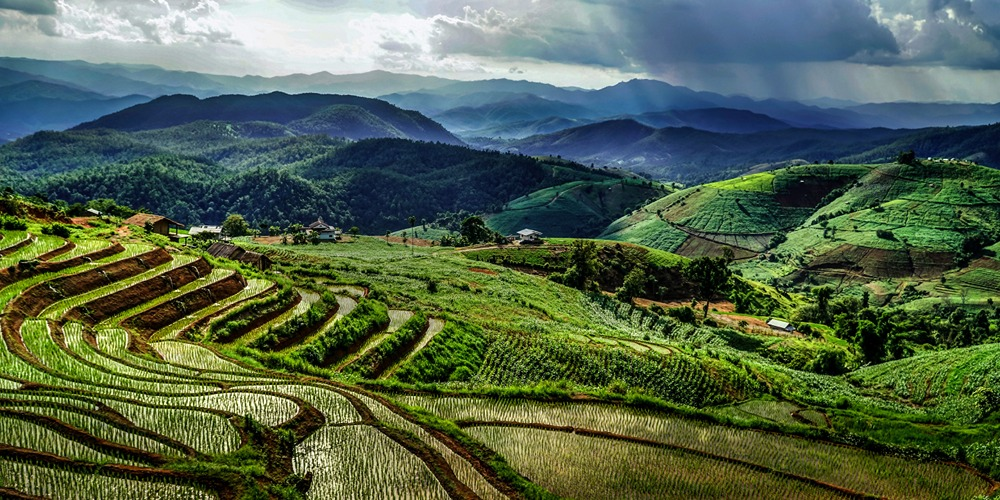

Planując podróż do Tajlandii, wiele osób zadaje pytanie "Co warto odwiedzić". Jako że sam temat jest szeroki jak rzeka, postanowiłem stworzyć stronę zbierającą informacje najciekawszych miejsc do zobaczenia w każdym z miast. W tym wypadku cały guide-book Chiang Mai przyjmie formę tras turystycznych.


# Post w trakcie zbierania informacji i formowania treści!

```terraform
Post w trakcie zbierania informacji i formowania treści!
```

## 1.


- dojazd lub przylot do chiang mai
- wynajem motoru lub auta
- wycieczka do galerii

[One Nimman](https://goo.gl/maps/SWcU294FTE2hC9tH8) jest marketem wzorowanym na styl europejskiego miasta. W środku budynku znajdziemy https://www.tripadvisor.com/Attraction_Review-g293917-d13496628-Reviews-One_Nimman-Chiang_Mai.html

## 2.


Trasa: https://goo.gl/maps/ogLepP3F4oxFrhFm6

- miejsca turystyczne w środku miasta
- piękna złocona świątynia
- starożytna 800-letnia świątynia
- najstarsza świątynia Chiang Mai
- najpopularniejszy nocny market Chiang Mai



[Wat Phra That Doi Suthep](https://goo.gl/maps/sUq7BVAbLaqLDU7u8), piękna pozłocona świątynia i duma Chiang Mai https://www.tourismthailand.org/Attraction/wat-phra-that-doi-suthep

[Wat Umong Suan Phutthatham](https://goo.gl/maps/CU6kBa5VuQ5R4W3i9) https://www.tourismthailand.org/Attraction/wat-umong

[Wat Phra Singh Woramahawihan](https://goo.gl/maps/k5TJdKrqvrXJTq7dA) https://www.renown-travel.com/temples/wat-phra-singh.html

[Tha Phae Walking Street](https://goo.gl/maps/G7bEY75HtFsAY6Sy5) https://www.bestpricetravel.com/travel-guide/thapae-walking-street.html

## 3.
")

Trasa: https://goo.gl/maps/zMDUC3GXpCRdbesR6

- park linowy
- ogród botaniczny
- kampus słoni
- kanion




[Pongyang Jungle Coaster Zipline Camp&Resort](https://goo.gl/maps/XR4TAMSABLcL3YT89) https://www.wongnai.com/attractions/349985bq-pongyang-jungle-coaster-zipline-camp-resort?ref=ct

[Queen Sirikit Botanic Garden](https://goo.gl/maps/9779ve9YDvKUkJSa9) https://www.tripadvisor.com/Attraction_Review-g1766192-d548427-Reviews-Queen_Sirikit_Botanic_Garden-Mae_Rim.html

[Mae Sa Elephant Camp](https://goo.gl/maps/uDPK781S2ZMBJkwWA) https://maesaelephantcamp.com/

[Phachor (Mae Wang National Park)](https://goo.gl/maps/zoKcxdka6UwtuSZr6) https://mychiangmaitour.com/pha-choi_or_pha-chor/ 

Looking for hotel near Doi In Tha non. 
https://www.paiduaykan.com/hotel/%E0%B8%97%E0%B8%B5%E0%B9%88%E0%B8%9E%E0%B8%B1%E0%B8%81%E0%B8%94%E0%B8%AD%E0%B8%A2%E0%B8%AD%E0%B8%B4%E0%B8%99%E0%B8%97%E0%B8%99%E0%B8%99%E0%B8%97%E0%B9%8C/

## 4.


Trasa: https://goo.gl/maps/t8ZMevyX5Jgv8vBV7

- nocka w górach
- podróż przez szlak w górach
- zwiedzanie krajobrazów parku narodowego
- świątynia w górach
- piękne wodospady
- powrót do miasta następnego dnia




[Kew Mae Pan nature trail](https://goo.gl/maps/tuDiPT5MmWzp7Woo8) https://www.chiangmaitraveller.com/kew-mae-pan-nature-trail-chiang-mai/

[Doi Inthanon National Park](https://goo.gl/maps/VoDKZTzAESSfsH2w9) https://www.saltinourhair.com/thailand/doi-inthanon/

There are many waters fall near Doi In Tha non and place to visit.
https://travel.trueid.net/detail/zRMY0yBLNwvR

Sleep there more one night and back to city return Motorbike or car then going to airport to next trip, Time to say good bye.

## 5.


**** I have more options for you if want to visit or change the plan.****
[Warorot Market (Kad Luang)](https://goo.gl/maps/LR7snCmRHR9NZAUY7) https://www.chiangmai-alacarte.com/blog/warorot-market-in-chiang-mai/

Museums in Chiang Mai 
https://www.tripsavvy.com/best-museums-in-chiang-mai-thailand-5198372

Top list place in Chiang Mai.
https://travel.trueid.net/detail/K2qVnyVo7MO


Sprawdź więcej miejsc do odwiedzenia w innych popularnych miejscach w Tajlandii!

- Co warto odkryć w Pattaya (w trakcie)
- Co warto odkryć w Phuket (w trakcie)
- [Co warto odkryć w Bangkoku](/co-warto-odkryc-w-bangkoku)
