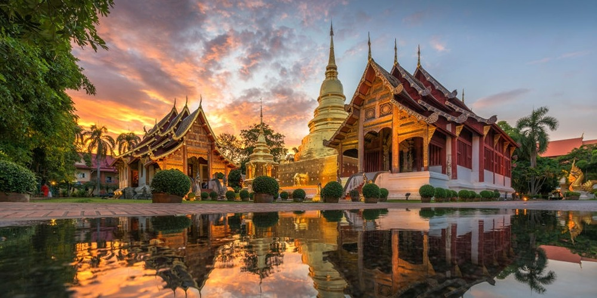
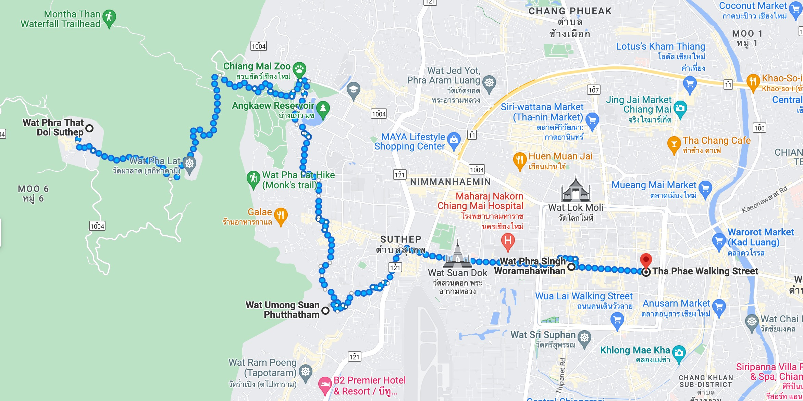
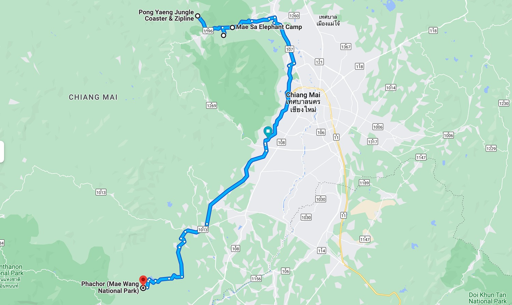
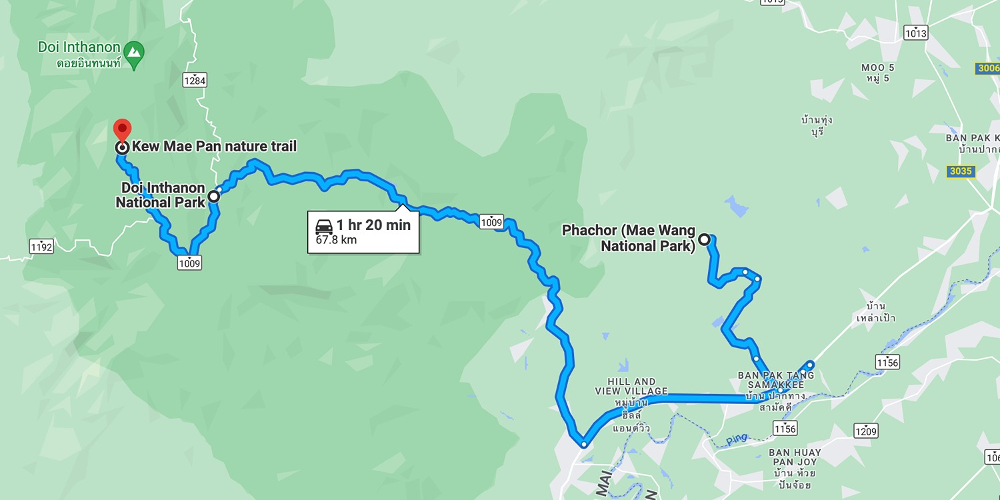
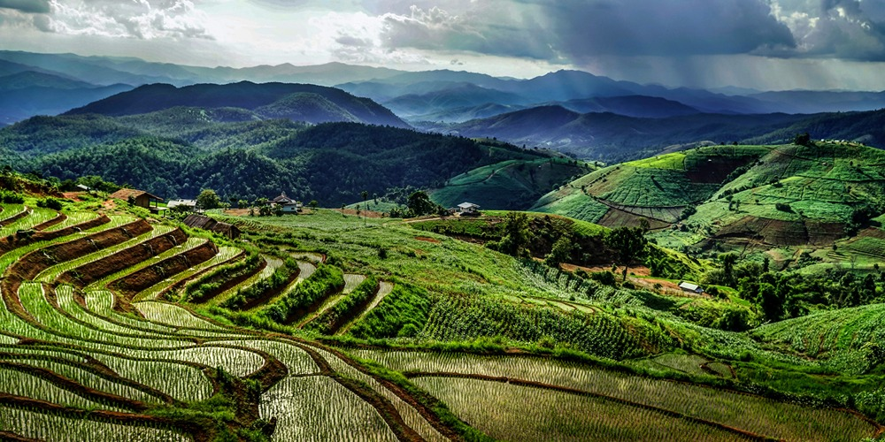

Planując podróż do Tajlandii, wiele osób zadaje pytanie "Co warto odwiedzić". Jako że sam temat jest szeroki jak rzeka, postanowiłem stworzyć stronę zbierającą informacje najciekawszych miejsc do zobaczenia w każdym z miast. W tym wypadku cały guide-book Chiang Mai przyjmie formę tras turystycznych. 

Zebrane informacje o Chiang Mai i plan wycieczek ułożyła dla mnie moja dziewczyna — tak więc możecie być pewni, że jako osoba z północy Tajlandii, z pewnością śledząc trasy, odkryjecie najciekawsze rzeczy tego regionu. 

## 1. Pierwszy dzień w Chiang Mai

Przyjazd do miasta może trochę zająć, szczególnie kiedy chcemy dostać się do docelowego miejsca dziesięciogodzinną nocną trasą busem lub pociągiem. Dla tych, co cenią sobie czas, istnieje także opcja szybkich lotów międzymiastowych. 

Co zawsze sugeruję przy podróżach w mniejszych miastach, jest wynajem pojazdu. Jeśli potrafimy szybko dopasować się do ruchu ulicznego i odwrotnego schematu pierwszeństwa, przed przylotem do Tajlandii możemy postarać się o dostanie Międzynarodowego Prawo Jazdy. Z tym dokumentem będziemy w stanie wypożyczyć auto, które pomoże nam w zwiedzaniu okolicznych miejsc. Aczkolwiek, najpopularniejszą opcją z pewnością jest wynajem skuterów. Oficjalnie di ich wynajmu musimy potwierdzić, że mamy uprawnienie na pojazdy tylu _"A"_, lecz z mojego doświadczenia mogę powiedzieć, że z łatwością znajdziemy wypożyczalnie dla turystów, którzy nie wymagają prawa jazdy. Dla tych, którzy boją się kontroli, mandaty w Tajlandii [nie są tak drogie](https://www.phuket-motorbike-rental.com/the-penalties-for-traffic-offenses-in-thailand/) i zawsze można _dogadać z policjantami w kwestii wysokości mandatu_.

Mając już pojazd lub decydując się jednak na dojazd z użyciem Grab, możemy zwiedzić miasto. Polecam zacząć od [One Nimman](https://goo.gl/maps/SWcU294FTE2hC9tH8) — marketu wzorowanego na europejski styl.

## 2. Drogą przez świątynie Chiang Mai

> [Trasa: Wat Phra That Doi Suthep - Tha Phae Walking Street, 14.3km, 3h pieszo](https://goo.gl/maps/ogLepP3F4oxFrhFm6)

#### Obiekty na trasie:
- [Wat Phra That Doi Suthep](https://goo.gl/maps/sUq7BVAbLaqLDU7u8), dowiedz się więcej na [tourismthailand.org](https://www.tourismthailand.org/Attraction/wat-phra-that-doi-suthep)
- [Wat Umong Suan Phutthatham](https://goo.gl/maps/CU6kBa5VuQ5R4W3i9), dowiedz się więcej na [tourismthailand.org](https://www.tourismthailand.org/Attraction/wat-umong)
- [Wat Phra Singh Woramahawihan](https://goo.gl/maps/k5TJdKrqvrXJTq7dA), dowiedz się więcej na [renown-travel.com](https://www.renown-travel.com/temples/wat-phra-singh.html)
- [Tha Phae Walking Street](https://goo.gl/maps/G7bEY75HtFsAY6Sy5), dowiedz się więcej na [bestpricetravel.com](https://www.bestpricetravel.com/travel-guide/thapae-walking-street.html)

Trasa prowadzi przez klasyczne turystyczne miejsca Chiang Mai. Zaczynając od centrum miasta wypełnionym sklepikami i lokalnymi sprzedawcami, przechodząc przez historyczne i klasyczne świątynie, kończąc na dumie miasta, świątyni _Wat Phra That Doi Suthep_. Wieczorem można zajrzeć raz jeszcze na market [Tha Phae Walking Street](https://goo.gl/maps/G7bEY75HtFsAY6Sy5), oferującym w tym okresie więcej usług.

## 3. Trasa odpoczynku, adrenaliny, słoni i kanionów
")

> [Trasa: Pong Yaeng Jungle Coaster & Zipline - Phachor (Mae Wang National Park), 84.8km, 2h pojazdem](https://goo.gl/maps/zMDUC3GXpCRdbesR6)

#### Obiekty na trasie:
- [Pongyang Jungle Coaster Zipline Camp&Resort](https://goo.gl/maps/XR4TAMSABLcL3YT89), dowiedz się więcej na [wongnai.com](https://www.wongnai.com/attractions/349985bq-pongyang-jungle-coaster-zipline-camp-resort)
- [Queen Sirikit Botanic Garden](https://goo.gl/maps/9779ve9YDvKUkJSa9), dowiedz się więcej na [tripadvisor.com](https://www.tripadvisor.com/Attraction_Review-g1766192-d548427-Reviews-Queen_Sirikit_Botanic_Garden-Mae_Rim.html)
- [Mae Sa Elephant Camp](https://goo.gl/maps/uDPK781S2ZMBJkwWA), dowiedz się więcej na [maesaelephantcamp.com](https://maesaelephantcamp.com/)
- [Phachor (Mae Wang National Park)](https://goo.gl/maps/zoKcxdka6UwtuSZr6), dowiedz się więcej na [mychiangmaitour.com](https://mychiangmaitour.com/pha-choi_or_pha-chor/) 

Drogę zaczynamy od parku linowego i kolejki saneczkowej. W okolicy znajdziemy także ogród botaniczny oraz kampus słoni, gdzie możemy zobaczyć je z bliska, jak żyją, malują obrazy wraz z możliwością przejażdżki na ich grzbiecie. Po atrakcjach na północy Chiang Mai czeka nas dłuższa przeprawa drogami w stronę kanionu [Phachor (Mae Wang National Park)](https://goo.gl/maps/zoKcxdka6UwtuSZr6). 

Planując przeprawę na następny dzień do parku narodowego [Doi Inthanon National Park](https://goo.gl/maps/VoDKZTzAESSfsH2w9), warto znaleźć sobie wcześniej nocleg w jego pobliżu. Dostępne miejsca postoju możemy znaleźć na [tej stronie](https://www.paiduaykan.com/hotel/%E0%B8%97%E0%B8%B5%E0%B9%88%E0%B8%9E%E0%B8%B1%E0%B8%81%E0%B8%94%E0%B8%AD%E0%B8%A2%E0%B8%AD%E0%B8%B4%E0%B8%99%E0%B8%97%E0%B8%99%E0%B8%99%E0%B8%97%E0%B9%8C/), pomagając sobie z tłumaczem google. Oczywiście możemy także skorzystać z aplikacji Booking lub Agoda.

## 4. Podróżując po szklakach górskich

> [Trasa: Phachor (Mae Wang National Park) - Doi Inthanon National Park, 67.8km, 1h20m pojazdem](https://goo.gl/maps/t8ZMevyX5Jgv8vBV7)

#### Obiekty na trasie:
- [Kew Mae Pan nature trail](https://goo.gl/maps/tuDiPT5MmWzp7Woo8), dowiedz się więcej na [chiangmaitraveller.com](https://www.chiangmaitraveller.com/kew-mae-pan-nature-trail-chiang-mai/)
- [Doi Inthanon National Park](https://goo.gl/maps/VoDKZTzAESSfsH2w9), dowiedz się więcej na [saltinourhair.com](https://www.saltinourhair.com/thailand/doi-inthanon/)
- wodospady i wszystkie inne miejsca w okolicy Doi Inthanon National Park opisane na stronie [travel.trueid.net](https://travel.trueid.net/detail/zRMY0yBLNwvR)

Chiang Mai posiada naprawdę przepiękne tereny górzyste, które można oglądać godzinami. Po spędzonej nocy w okolicznych hotelach warto wybrać się na szlak górski z naprawdę zapierającymi dech w piersiach widokami. Po drodze możemy także zawitać do świątyni [Pra Mahatat Noppamethanedon and Pra Mahatat Nopphonphusiri](https://goo.gl/maps/KJGBRFtYMBnKyzVc9), znajdującej się niecałe 15min pojazdem od górskiego szlaku. W okolicy znajdziemy także wiele pięknych wodospadów, punktów widokowych, ścieżek prowadzących przez lasy czy w styczniu uwiecznić na zdjęciach różowo kwitnące wiśnie. 

Przez to, że droga powrotna do Chiang Mai jest dość długa, sugeruję przespać się jedną dodatkową noc w górach. Ruszając następnego dnia z rana do miasta, znajdziemy czas na zakupy pamiątek i złapanie lotu do następnego miasta.

## 5. Każda trasa może być modyfikowana

Dla osób, które nie chcą opuszczać tak daleko miasta, istnieją także inne rzeczy, które można zobaczyć w mieście. Z dostępnych opcji do odwiedzenia będzie z pewnością [Warorot Market (Kad Luang)](https://goo.gl/maps/LR7snCmRHR9NZAUY7) (opis marketu znajdziemy [tutaj](https://www.chiangmai-alacarte.com/blog/warorot-market-in-chiang-mai/)), muzea ([8 najlepszych muzeów w Chiang Mai](https://www.tripsavvy.com/best-museums-in-chiang-mai-thailand-5198372)), a także inne ciekawe [rzeczy do odkrycia](https://travel.trueid.net/detail/K2qVnyVo7MO) w mieście.
___

Sprawdź więcej miejsc do odwiedzenia w popularnych w Tajlandii!

- Co warto odkryć w Pattaya (w trakcie)
- Co warto odkryć w Phuket (w trakcie)
- [Co warto odkryć w Bangkoku](/co-warto-odkryc-w-bangkoku)
